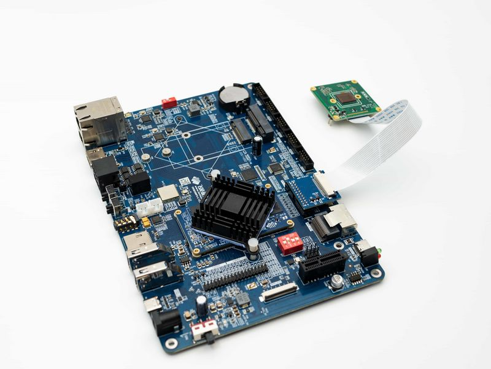

# HOW to use VEYE Camera on Forlinx i.MX8 board

## Overview
OKMX8MPQ-C board from Forlink embedded uses i.MX8M plus processor.
On the basis of Forlink 's official SDK(OKMX8MP-C_Linux5.4.70+Qt5.15.0 version), our camera module driver is added, and some application layer routines are provided.
In general, you only need to use the Image and dtb that we have compiled. Of course, you can also modify or recompile the driver according to our open source code.
### Camera module list
| Series  | Model  | Status  | Adaptor board  |
| ------------ | ------------ | ------------ | ------------ |
| VEYE Series  | VEYE-MIPI-IMX327S  | Done  | ADP-Forlinx  |
| VEYE Series  | VEYE-MIPI-IMX462  | Done  | ADP-Forlinx  |
| VEYE Series  | VEYE-MIPI-IMX385  | Done  | ADP-Forlinx  |

VEYE and CS series camera modules are camera module with ISP functions build in. It output UYVY/YUYV data using MIPI-CSI2. We provide V4L2 interface for video streaming apps , and Video Control Toolkits (which is Shell Script) to control the camera module directly, which is called DRA(Directly Register Access).

Specifically, on this i.MX platform, the default driver configures the camera to YUYV format.

## Hardware Setup

We use [ADP-Forlinx](https://wiki.veye.cc/index.php/ADP-Forlinx_Adapter_Board_Data_Sheet) to connnect the camera with OKMX8MPQ-C board.

The camera and ADP-Forlinx are connected using 1.0 mm pitch*15P FFC cable with opposite direction. The cable must be inserted with the silver contacts facing outside.


## Upgrade OKMX8MPQ-C system
### Overview
This section describes how to update the OKMX8MPQ-C system to support our camera module. To support our camera module, we need to update two parts of the system, Image and DTB.

In the Image, we added the camera driver, while the DTB indicates the camera model used. In general, you only need to use the Image and DTB, that we have prebuilt, and you don't need to build from source when it is not necessary.

The released files were compiled based on the image of OKMX8MP-C_Linux5.4.70+Qt5.15.0 version.

### BSP package introduction
####  i.MX platform bsp
https://github.com/veyeimaging/nxp_i.mx_veye_bsp

includes：
- driver source code
- i2c toolkits
- application demo

#### Folinx i.MX platform bsp
https://github.com/veyeimaging/forlinx_nxp_i.mx

includes：
- prebuild linux kernel：Image
- prebuild dtb for different boards
- dts source code

### Burn the Forlinx standard system
Refer to : OKMX8MPQ-C_Linux5.4.70+Qt5.15.0Manual_V1.2_20230406.pdf
Burn the standard system provided by Forlinx to the board.

### Using prebuilt Image and dtb file

The Image and dtb files of the OKMX8MPQ-C board are saved in the FAT partition of emmc. After the system is started, it is automatically mounted to the `/run/media/mmcblk2p1/` directory.

On HOST PC:

`git clone https://github.com/veyeimaging/forlinx_nxp_i.mx.git`

Extract the kernel Image, and copy the Image and dtb files to the OKMX8MPQ-C board.
```
cp <your path>/Image /run/media/mmcblk2p1/
cp <your path>/OK8MP-C.dtb /run/media/mmcblk2p1/
```
Reboot OKMX8MPQ-C board.

## Applications and Test
### Check system status

Run the following command to confirm whether the camera is probed.

- VEYE-MIPI-IMX327S,VEYE-MIPI-IMX462,VEYE-MIPI-IMX385

`dmesg | grep veye `
The output message appears as shown below：
```
[    2.806555] veyecam2m 1-003b:  camera id is veyecam2m

[    2.816868] veyecam2m 1-003b: sensor is IMX327

[    2.821323] veyecam2m 1-003b: board type is ONE board

[    2.826981] veyecam2m 1-003b: veyecam2m camera probed

[    6.055710] mx8-img-md: Registered sensor subdevice: veyecam2m 1-003b (1)

[    6.150181] mx8-img-md: created link [veyecam2m 1-003b] => [mxc-mipi-csi2.1]
```
It can be seen that the VEYE-MIPI-IMX327S camera has been identified on i2c-1.

Once the camera is correctly recognized, a device node named `/dev/video0` will be generated.

- List the formats supported by the camera

```
v4l2-ctl --list-formats-ext -d /dev/video0

ioctl: VIDIOC_ENUM_FMT

        Type: Video Capture Multiplanar

        [0]: 'RGBP' (16-bit RGB 5-6-5)

                Size: Discrete 1920x1080

        [1]: 'RGB3' (24-bit RGB 8-8-8)

                Size: Discrete 1920x1080

        [2]: 'BGR3' (24-bit BGR 8-8-8)

                Size: Discrete 1920x1080

        [3]: 'YUYV' (YUYV 4:2:2)

                Size: Discrete 1920x1080

        [4]: 'YUV4' (32-bit A/XYUV 8-8-8-8)

                Size: Discrete 1920x1080

        [5]: 'NV12' (Y/CbCr 4:2:0)

                Size: Discrete 1920x1080

        [6]: 'YM24' (Planar YUV 4:4:4 (N-C))

                Size: Discrete 1920x1080

        [7]: 'XR24' (32-bit BGRX 8-8-8-8)

                Size: Discrete 1920x1080

        [8]: 'AR24' (32-bit BGRA 8-8-8-8)

                Size: Discrete 1920x1080
```
In fact, the camera only provides UYVY data format, and the ISI module in i.MX 8M Plus provides data format conversion function, so /dev/video0 has so many output formats.

## Video Stream test
### Preview (VEYE-MIPI-CAM@1080p mode)
```
gst-launch-1.0 v4l2src device=/dev/video0 ! video/x-raw, format=NV12, width=1920, height=1080,framerate=30/1 ! autovideosink -v
```
or
```
gst-launch-1.0 v4l2src device=/dev/video0 io-mode=4 ! video/x-raw, format=NV12, width=1920, height=1080,framerate=30/1 ! imxvideoconvert_g2d ! queue ! video/x-raw, format=RGB16, width=1920, height=1080 ! waylandsink
```
### Snap a picture (VEYE-MIPI-CAM@1080p mode)
```
gst-launch-1.0 v4l2src num-buffers=1 device=/dev/video0 ! 'video/x-raw, width=1920,height=1080' ! jpegenc ! filesink location=test_image.jpg
```
### v4l2grab snap a picture(VEYE-MIPI-CAM@1080p mode)
```
./v4l2grab -d /dev/video0 -W 1920 -H 1080 -I 30 -o picture.jpg
```

## I2C Control Toolkits Manual

Because of the high degree of freedom of our camera parameters, we do not use V4L2 parameters to control, but use scripts to configure parameters.

https://github.com/veyeimaging/nxp_i.mx_veye_bsp/tree/main/i2c_cmd

Using -b option to identify which bus you want to use, please use -b 1 for OKMX8MPQ-C.

VEYE series

Video Control Toolkits Manual ：[VEYE-MIPI-327 I2C](http://wiki.veye.cc/index.php/VEYE-MIPI-290/327_i2c/)

## Build the drivers from source

The following operations are done on Ubuntu Host PC.

### Set up the Host PC environment

Refer to the official document OKMX8MPQ-C_Linux5.4.70+Qt5.15.0_manual_V1.2_20230406.pdf to deploy the development environment.

### Build Forlinx version kernel

Compile the standard version according to the above document.

### Patch code
- Driver source code

`git clone https://github.com/veyeimaging/nxp_i.mx_veye_bsp.git`

The source code path of the camera driver is: `linux/drivers/media/i2c`, places the source code of the camera driver in the corresponding directory.

Merge the Config and Makefile in the same path. Add the corresponding camera driver.

- dts file

`git clone https://github.com/veyeimaging/forlinx_nxp_i.mx.git`

The path to the dts file is: `linux/arch/arm64/boot/dts/freescale`, places the dts file in this path.

Modify the Config and Makefile in the same path. Add the corresponding dts option.

### Add compilation options

`make menuconfig`

Add the compilation options for the corresponding camera module driver, and the path is `> Device Drivers > Multimedia support > I2C Encoders, decoders, sensors and other helper chips` .

### Build

Refer to the official documentation and compile to obtain Image and dtb output.